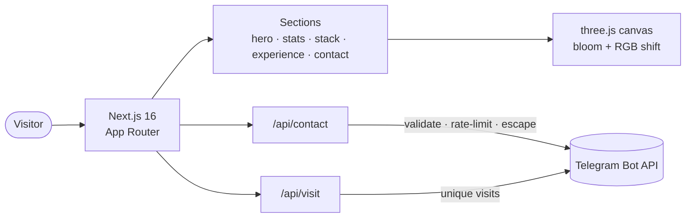

<div align="center">

# alyjnsv.pro

**Personal portfolio of Alii Dzhansuev — AI Automation Engineer**

*I take LLMs to production, not to demos.*

[](https://alyjnsv.pro)


</div>

---

## ✨ Highlights

|  |  |
| --- | --- |
| 🎨 **three.js hero** | Instanced-mesh dot grid (14 400 instances) with bloom + RGB-shift post-processing, driven by a single `requestAnimationFrame` loop |
| 🌍 **Bilingual RU/EN** | Custom i18n context on `useSyncExternalStore` — SSR-safe, syncs across tabs, zero dependencies |
| ✉️ **Contact form → Telegram** | Submissions land in Telegram instantly; honeypot + per-IP rate limiting + input sanitization |
| 📈 **Visit notifications** | Unique visits are reported to Telegram with device/language breakdown |
| 🎬 **Scroll animations** | One tiny `useInView` hook (IntersectionObserver) — no animation libraries |

## 🏗 Architecture



Static-first: the whole page is prerendered, only the two API routes are dynamic.

## 🚀 Quick start

```bash
npm install
npm run dev        # http://localhost:3000
```

Telegram notifications are optional — copy `.env.example` to `.env.local` to enable them:

| Variable | Purpose |
| --- | --- |
| `TELEGRAM_BOT_TOKEN` | Bot token from [@BotFather](https://t.me/BotFather) |
| `TELEGRAM_CHAT_ID` | Chat that receives form submissions and visit reports |

Without them the site runs fine; notifications are simply skipped.

## 📁 Structure

```
app/
├── api/contact/     # form → Telegram (honeypot, rate limit, HTML escaping)
├── api/visit/       # unique-visit notifications
├── layout.tsx       # fonts, metadata, i18n provider
└── page.tsx         # section composition
src/
├── components/
│   ├── sections/    # Hero, WhatIDo, Stats, Stack, Experience, Values, Contact
│   └── ui/          # three.js hero background
├── hooks/useInView.ts
└── lib/i18n.ts      # all RU/EN copy in one typed object
```

---

<div align="center">

**[alyjnsv.pro](https://alyjnsv.pro)** · [Telegram](https://t.me/broplemspb) · [hello@alyjnsv.pro](mailto:hello@alyjnsv.pro)

</div>
